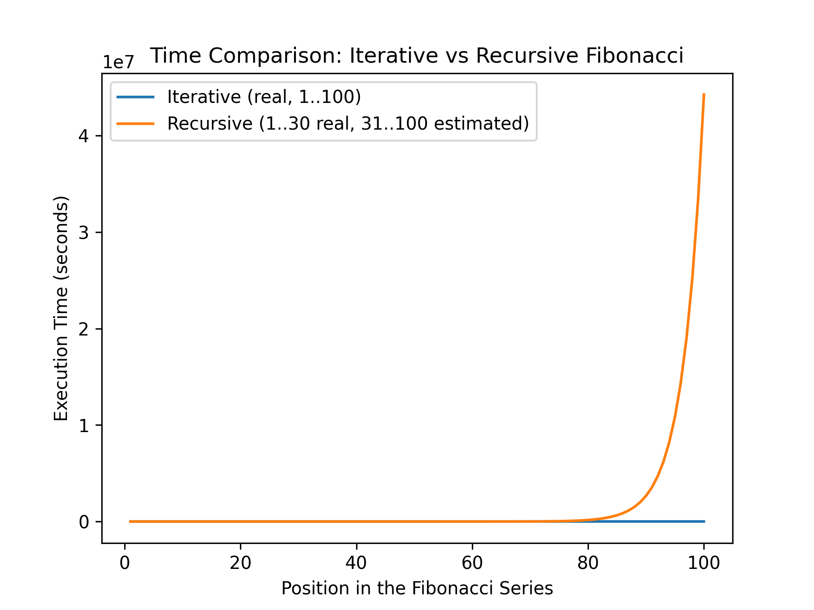

## 📊 Performance Analysis
This project compares the performance of two algorithms for calculating Fibonacci numbers:

- **Iterative Algorithm** – Efficient and fast (calculated up to position 100).
- **Recursive Algorithm** – Classic recursion with exponential complexity (calculated up to position 30, with estimated values projected up to 100).

---

## 🚀 Project Structure
```
📂 Project Folder
└── 📂 src
    ├── Fib_I.py         # Iterative Fibonacci implementation
    ├── Fib_R.py         # Recursive Fibonacci implementation
    ├── main.py          # Main script for execution, CSV generation, and graph plotting
    ├── fibonacci_results.csv   # CSV file with calculated values and timings
    └── fibonacci_chart.png      # Graph comparing both algorithms
└── README.md        # This documentation
```

---

## 📋 How to Run
1. Clone this repository:
   ```bash
   git clone <repository-url>
   cd <repository-folder>
   ```

2. Install dependencies (if needed):
   ```bash
   pip install matplotlib
   ```

3. Run the main script:
   ```bash
   python main.py
   ```

4. The results will be generated as:
   - **`fibonacci_results.csv`** — Table with Fibonacci values and timings.
   - **`fibonacci_chart.png`** — Graph comparing both methods.

---

## 📈 Results
Below is the generated graph comparing the performance of the two algorithms:



### Explanation
- The **blue line** represents the **iterative method**, which scales efficiently.
- The **orange line** represents the **recursive method**:
  - Real data points are calculated up to position 30.
  - From position 31 onward, the values are **estimated** based on previous timings.

---

## 🧐 Understanding the Challenge
The project demonstrates the key performance difference between:
- **Iterative Fibonacci** (linear complexity - \(O(n)\))
- **Recursive Fibonacci** (exponential complexity - \(O(2^n)\))

Since the recursive method without memoization becomes extremely slow for larger values, the implementation includes a **timeout** and **extrapolation** to provide realistic insights into performance.

---

## 📌 Author
**Daniel Tomm**
🖥️ Computer Engineering Student @ UNIPAMPA  
📧 danielfelipetomm@gmail.com 

---

If you have any questions or feedback, feel free to open an issue or submit a pull request! 😊